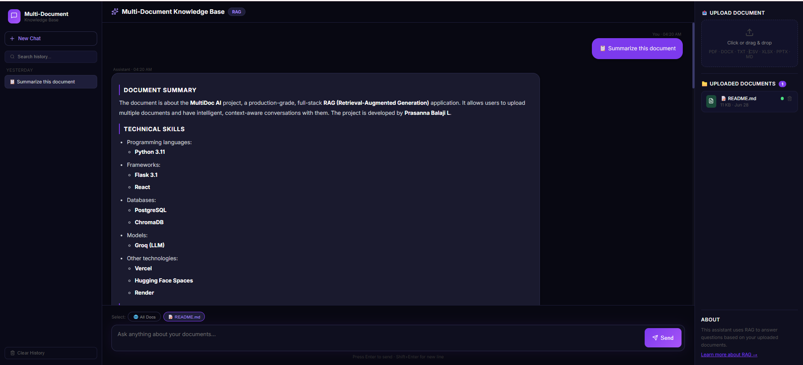

# MultiDoc AI — Multi-Document Knowledge Base Chatbot

> A production-grade, full-stack RAG (Retrieval-Augmented Generation) application that lets you upload multiple documents and have intelligent, context-aware conversations with them.

🔗 **Live Demo:** [multi-doc-knowledge-base.vercel.app](https://multi-doc-knowledge-base.vercel.app)  
🧠 **Backend API:** [prasannabalaji-multidoc-ai-backend.hf.space](https://prasannabalaji-multidoc-ai-backend.hf.space)

[](https://python.org)
[](https://flask.palletsprojects.com)
[](https://react.dev)
[](https://chromadb.com)
[](https://groq.com)
[](LICENSE)

---

## What Is This?

MultiDoc AI is a **production-ready RAG chatbot** built entirely from scratch. You upload your documents — PDFs, Word files, spreadsheets, presentations, and more — and the app lets you ask natural language questions about them. Answers are grounded in your actual document content, cited by source, and streamed in real time.

This project demonstrates end-to-end ownership of the GenAI stack: document ingestion, vector search, adaptive retrieval, LLM prompting, streaming APIs, and a fully responsive React frontend — all deployed on free-tier cloud infrastructure.

---

## Live Demo

| Action | Result |
|--------|--------|
| Upload a PDF | Parsed, chunked, embedded, stored in ChromaDB |
| Ask a question | Intent detected → RAG strategy selected → Groq LLM answers |
| View source | Every answer cites which document it came from (only when the answer actually came from a document) |
| Ask about the conversation | "What did I ask before this?" is answered from real chat history, not routed through document search |
| Chat history | Sessions persisted in PostgreSQL, grouped by date |
| Mobile | Full bottom-tab navigation, works on any device |

---

<p align="center">
  
</p>

---

## Features

### Core RAG
- 🧠 **Adaptive RAG strategies** — automatically selects the best retrieval method based on document size
- 🔍 **Dense vector search** — ChromaDB with `all-MiniLM-L6-v2` embeddings, L2 distance scoring
- 🎯 **LLM-based intent detection** — classifies each message by underlying intent (greeting, casual, general knowledge, meta-conversation, or document) rather than keyword matching, so it generalizes to phrasing it hasn't seen before
- 💬 **Conversation-aware meta questions** — "what did I ask before this" or "what did we just discuss" are answered directly from real chat history instead of being misrouted into document search
- 📊 **Accurate source citations** — a document is only cited when the answer actually came from it; general-knowledge and meta answers never carry a stale source
- 🔄 **Query expansion** — generates 3 search variants and merges results for better recall
- 🏗️ **Hierarchical retrieval** — two-pass strategy for very large document collections (>3000 chunks)
- 🪟 **Conversation history** — sliding window of the last 4 messages passed to the LLM for context continuity (a deliberate token-budget tradeoff — very long-range "what was my very first message" recall is out of this window by design)

### Document Support
- 📄 **7 file formats** — PDF, DOCX, TXT, CSV, XLSX, PPTX, Markdown
- 🔎 **OCR fallback** — scanned/image PDFs handled via Tesseract
- 📋 **Table extraction** — tables parsed from PDF, DOCX, XLSX and included in context
- 🗑️ **Live document management** — upload, delete, and re-index documents without restarting

### Production Engineering
- ⚡ **SSE streaming** — token-by-token response with blinking cursor animation
- 🛡️ **Token budget management** — context and output caps tuned to the current model's actual Groq free-tier rate limit (see Tech Stack below); adjusted whenever the underlying model changes
- 🔁 **Retry + relaxed threshold fallback** — if no chunks pass relevance filter, retries with looser threshold before falling back to general knowledge
- 🗂️ **PostgreSQL chat history** — persistent across sessions and deployments
- 📱 **Fully responsive** — 3-panel desktop layout + mobile bottom-tab navigation

---

## Tech Stack

| Layer | Technology |
|-------|-----------|
| **LLM** | Groq API — `openai/gpt-oss-120b` |
| **Embeddings** | `sentence-transformers/all-MiniLM-L6-v2` |
| **Vector Store** | ChromaDB (persistent, no rebuild on restart) |
| **Backend** | Python 3.11, Flask, Gunicorn |
| **Database** | PostgreSQL via psycopg2 (hosted on Render's free tier — see note below) |
| **Frontend** | React + Vite, Axios, Lucide React, React Markdown |
| **Deployment** | Hugging Face Spaces (Docker) + Vercel + Render |

> **A note on the LLM:** Groq periodically deprecates older models (this project originally ran on Llama 3.3 70B, retired by Groq in August 2026) and each model has its own free-tier token-per-minute ceiling. The model name and the token-budget constants in `query.py` are expected to change again whenever Groq rotates their free-tier lineup — check `console.groq.com/settings/limits` for current numbers before assuming the values below are still accurate.

> **A note on the database:** the Postgres instance is on Render's **free tier**, which expires 30 days after creation and needs to be recreated (or migrated to a provider without that limit) periodically. Treat the database connection details as something that changes over time, not a fixed, permanent piece of infrastructure.

---

## Architecture

```
User → React Frontend (Vercel)
         │
         ▼
   Flask API (Hugging Face Spaces)
         │
         ├─► LLM Intent Detection (Groq, reasoning-based classification)
         │         │
         │    greeting / casual        → direct LLM response, no sources
         │    meta (about this chat)   → answered from real conversation history, no sources
         │    general_knowledge        → LLM without RAG, no sources
         │    document                 → full RAG pipeline ↓
         │
         ├─► Document Targeting (which doc to search)
         │
         ├─► Strategy Selection
         │       ≤80 chunks    → Deep Read
         │       ≤600 chunks   → Standard RAG
         │       ≤3000 chunks  → Query Expansion RAG
         │       >3000 chunks  → Hierarchical RAG
         │
         ├─► ChromaDB Vector Retrieval
         │
         ├─► Token Budget Cap (tuned to current model's Groq TPM limit)
         │
         ├─► Groq LLM Generation
         │
         ├─► Source-citation check (cleared if the answer fell back to general knowledge)
         │
         ├─► SSE Streaming Response → Frontend
         │
         └─► PostgreSQL (chat history saved)
```

---

## RAG Pipeline — In Detail

### 1. Ingestion (`ingest.py`)
- Documents parsed per file type using dedicated extractors
- PDFs: PDFPlumber for text pages, Tesseract OCR fallback for scanned pages, table extraction per page
- DOCX: heading styles detected and preserved with `###` prefix for better chunking
- CSV/XLSX: column headers repeated in every chunk so context is preserved mid-file
- Chunked at 800 chars with 250 overlap using `RecursiveCharacterTextSplitter`
- Exact duplicates removed via MD5 fingerprint before embedding
- Embedded with `all-MiniLM-L6-v2` and stored in ChromaDB with rich metadata

### 2. Intent Detection (`query.py`)
- A single Groq call classifies every incoming message into one of five intents: `greeting`, `casual`, `general_knowledge`, `meta`, or `document`
- The classification prompt describes each intent by its underlying communicative purpose (e.g. "the user is maintaining social rapport") rather than listing example keywords, so it generalizes to phrasing that wasn't explicitly anticipated
- `meta` questions (about the conversation itself, e.g. "what did I ask before this") are answered directly from the real message history rather than routed into document retrieval

### 3. Retrieval (`query.py`)
| Strategy | Trigger | Method |
|----------|---------|--------|
| `deep_read` | ≤80 chunks | Read ALL chunks, token-capped |
| `standard_rag` | ≤600 chunks | Single query, sort by L2 distance, top-k |
| `query_expansion` | ≤3000 chunks | 3 query variants, merge + dedup by hash |
| `hierarchical` | >3000 chunks | Two-pass: broad first, then subtopic expansion |

### 4. Generation
- Prompt engineered to adapt response format to question type (factual → direct, list → bullets, summary → headers)
- Conversation history (last 4 messages) injected before the current prompt
- Groq `openai/gpt-oss-120b` with temperature 0.0 for grounded answers, 0.7–0.8 for casual/creative
- After generation, source citations are cleared if the answer text indicates it fell back to general knowledge — so a document is never cited unless the answer actually came from it

### 5. Streaming
- Full answer computed first, then streamed word-by-word via SSE
- Frontend appends tokens to the message bubble in real time with blinking cursor

---

## Supported File Types

| Format | Parser | Notes |
|--------|--------|-------|
| PDF | PDFPlumber + Tesseract | OCR fallback for scanned pages |
| DOCX | python-docx | Heading styles + table extraction |
| TXT / MD | Native read | Direct UTF-8 |
| CSV | pandas | Row-batched, headers repeated per chunk |
| XLSX | openpyxl | Per-sheet, headers repeated per chunk |
| PPTX | python-pptx | Slide titles + speaker notes |

---

## API Endpoints

| Method | Endpoint | Description |
|--------|----------|-------------|
| `POST` | `/upload` | Upload and index a document |
| `POST` | `/query` | Ask a question (non-streaming JSON) |
| `POST` | `/stream` | Ask a question (streaming SSE) |
| `GET` | `/history` | Get chat history (all or by session) |
| `DELETE` | `/clear` | Clear chat history |
| `GET` | `/docs` | List all uploaded documents |
| `DELETE` | `/delete-doc` | Delete a document and its vectors |

---

## Project Structure

```
multi-doc-knowledge-base/
├── app.py                  # Flask API — all 7 endpoints
├── ingest.py                # Document parsing, chunking, embedding, ChromaDB storage
├── query.py                 # RAG engine — intent detection, adaptive retrieval, Groq LLM
├── requirements.txt
├── hf-space/                 # Hugging Face Spaces deployment (Dockerfile + copies of backend; separate git remote, pushed independently)
└── frontend/
    └── src/
        ├── pages/
        │   └── ChatPage.jsx        # Main UI — 3-panel layout, mobile responsive
        ├── components/
        │   ├── Sidebar.jsx         # Chat history, search, new chat, date grouping
        │   ├── MessageBubble.jsx   # Markdown rendering, copy, thumbs up/down, timestamps
        │   └── DocsPanel.jsx       # Upload, drag & drop, doc list, delete, RAG info modal
        └── api/
            └── chat.js             # All API calls — upload, stream, history, docs. BASE URL is hardcoded to the production Hugging Face Space; only change it to localhost for local testing, and always revert before deploying
```

---

## Key Design Decisions

| Decision | Reasoning |
|----------|-----------|
| **ChromaDB over FAISS** | Persistent storage — no need to rebuild the index on every restart |
| **Groq over OpenAI** | Free tier access to strong open-weight models; fast inference, no cost — accepting that Groq periodically retires specific models and free-tier rate limits shift as a result |
| **Adaptive RAG strategies** | One-size retrieval fails on both tiny and huge docs; strategy auto-selected by chunk count |
| **Reasoning-based intent classification** | Describing each intent by its underlying purpose, rather than listing example keywords, generalizes to phrasings not explicitly anticipated (e.g. "how are you" as a greeting) |
| **Separate `meta` intent** | Questions about the conversation itself need to read real chat history, not be treated as document-search queries |
| **Token budget cap** | Sized to the current model's Groq free-tier TPM limit; revisited whenever the model changes, since different models get different limits |
| **HF Spaces Docker** | Reliable free hosting for ML backends; avoids cold-start issues of serverless |
| **SSE over WebSockets** | Simpler, stateless, works well for one-way token streaming |

---

## Local Setup

```bash
# 1. Clone the repo
git clone https://github.com/PrasannaBalaji29/multi-doc-knowledge-base.git
cd multi-doc-knowledge-base

# 2. Create and activate virtual environment
python -m venv venv
venv\Scripts\activate        # Windows
source venv/bin/activate     # Mac/Linux

# 3. Install backend dependencies
pip install -r requirements.txt

# 4. Create a .env file in the root
GROQ_API_KEY=your_groq_api_key
DATABASE_URL=your_postgresql_connection_string
# (or DB_HOST / DB_USER / DB_PASSWORD / DB_NAME / DB_PORT individually — app.py's
#  get_db() prefers DATABASE_URL if set, and falls back to the individual vars)

# 5. Run the backend
python app.py
# → Runs on http://localhost:5000

# 6. Run the frontend (new terminal)
cd frontend
npm install
npm run dev
# → Runs on http://localhost:5173
```

> **Note:** For PDF OCR support on Windows, install [Tesseract](https://github.com/UB-Mannheim/tesseract/wiki) and [Poppler](https://github.com/oschwartz10612/poppler-windows/releases). Update paths in `ingest.py` if needed.
>
> **Note:** `frontend/src/api/chat.js` is hardcoded to the production backend URL. To test against your local Flask server, temporarily change `BASE` to `http://127.0.0.1:5000` — and remember to change it back before pushing.

---

## Deployment

| Service | Platform | URL |
|---------|----------|-----|
| Frontend | Vercel | [multi-doc-knowledge-base.vercel.app](https://multi-doc-knowledge-base.vercel.app) |
| Backend | Hugging Face Spaces (Docker) | [prasannabalaji-multidoc-ai-backend.hf.space](https://prasannabalaji-multidoc-ai-backend.hf.space) |
| Database | Render PostgreSQL | Free tier — expires ~30 days after creation and is periodically recreated; not treated as permanent infrastructure |

**Deploying a backend change:** the `hf-space/` directory is its own separate git repository, not automatically synced with the project root. After editing `app.py` or `query.py`, copy the file into `hf-space/`, then `cd hf-space && git add . && git commit && git push` to redeploy the live Space — and separately push the same change from the project root to keep the public GitHub repo in sync.

**Deploying a frontend change:** `git push origin main` from the project root; Vercel auto-deploys.

---

## Maintenance Log

A running record of significant fixes and migrations, kept honest rather than presenting the project as untouched since launch:

- **Database migrations:** the Postgres database has been recreated more than once after Render's free-tier 30-day expiry. Connection details live in `.env` / the Hugging Face Space's secrets, not in this README, since they change.
- **LLM migration:** Groq deprecated `llama-3.3-70b-versatile` (August 2026); the project moved to `openai/gpt-oss-120b`, which carries a smaller free-tier token-per-minute allowance, so the context and output token budgets in `query.py` were reduced accordingly.
- **Intent classification rewrite:** the classifier prompt was reworked from an example-keyword list to a purpose-based description of each intent, after phrasings like "how are you" were misclassified under the old approach. A `meta` intent was added for questions about the conversation itself.
- **Source-citation fix:** answers that fall back to general knowledge (no relevant document match) no longer carry a stale document citation.
- **Timestamp fix:** chat history timestamps are now stored as true UTC, letting the frontend's timezone conversion display the correct local time (a prior manual offset was being double-applied).

---

## Author

**Prasanna Balaji L**

[](https://www.linkedin.com/in/prasanna-balaji-l)
[](https://github.com/PrasannaBalaji29)
[](https://www.naukri.com/mnjuser/profile?id=&altresid)

---

## License

MIT License — feel free to fork, use, and build on this.
